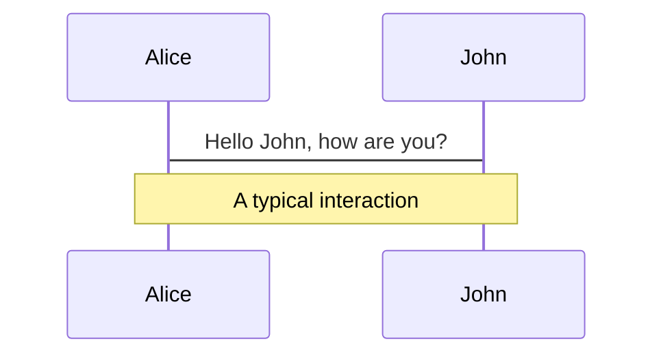
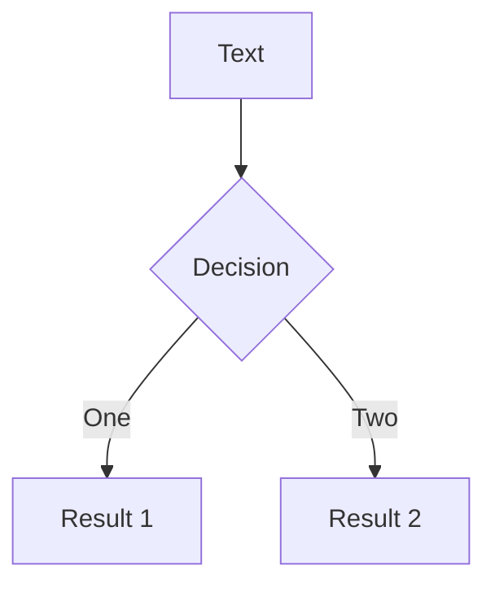
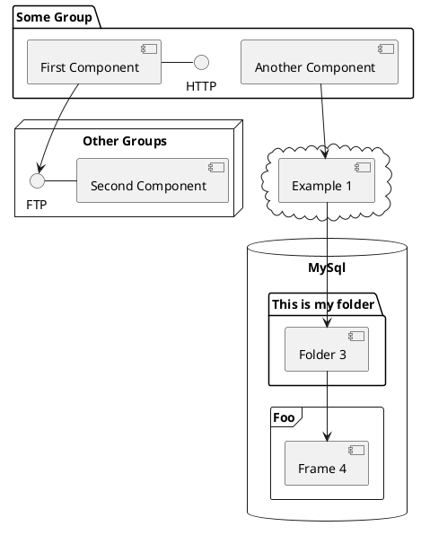

---
# try also 'default' to start simple
theme: seriph
# random image from a curated Unsplash collection by Anthony
# like them? see https://unsplash.com/collections/94734566/slidev
background: ./frameworks.png
# apply any windi css classes to the current slide
class: "text-center"
# https://sli.dev/custom/highlighters.html
highlighter: shiki
# show line numbers in code blocks
lineNumbers: false
# some information about the slides, markdown enabled
info: |
  ## Slidev Starter Template
  Presentation slides for developers.

  Learn more at [Sli.dev](https://sli.dev)
# persist drawings in exports and build
drawings:
  persist: false
# use UnoCSS
css: unocss
---

<style>
  .my-auto {
    background: rgba(0,0,0,.7);
    border-radius: 500px;
  }
  .slidev-layout h1 + p {
    color: white;
    opacity: .8;
  }
</style>

# The value of JS frameworks

Comparing Vanilla, Svelte, Vue, and React (kinda)

<div class="abs-br m-6 flex gap-2">
  <button @click="$slidev.nav.openInEditor()" title="Open in Editor" class="text-xl icon-btn opacity-50 !border-none !hover:text-white">
    <carbon:edit />
  </button>
</div>

<!--
The last comment block of each slide will be treated as slide notes. It will be visible and editable in Presenter Mode along with the slide. [Read more in the docs](https://sli.dev/guide/syntax.html#notes)
-->

---

# Why JS Frameworks?

The JS ecosystem is intensely complicated, why do we do it to ourselves?

- 🏃🏻‍♂️ **Speed?** - Vanilla JS is faster\*
- 🚢 **Size?** - Even the slimmest frameworks create a bigger bundle than Vanilla\*
- 🔐 **Security?** - JS dependencies create a vast surface area for security issues\*\*

<br/>
<br/>
<br/>

<div>
	<small>* Usually</small>
</div>

<div>
	<small>** Always</small>
</div>

<!--

-->

<style>
h1 {
  background-color: #2B90B6;
  background-image: linear-gradient(45deg, #4EC5D4 10%, #146b8c 20%);
  background-size: 100%;
  -webkit-background-clip: text;
  -moz-background-clip: text;
  -webkit-text-fill-color: transparent;
  -moz-text-fill-color: transparent;
}
</style>

<!--
Here is another comment.
-->

---

# DX - Developer Experience

Frameworks make our jobs easier\*

- ✨ **Well Documented APIs** - Devs don't have to spend time figuring out what the fiddly bits do
- 🍰 **Baked in patterns** - Try _not_ using Component Trees in a modern framework
- 🏋️‍♀️ **Does the heavy lifting** - Bind some text to a template and just update that node -> { someText }
- 🍺 **No Framework === 'BYOF'** - It'll either be a mess or your own React competitor

<br/>
<br/>
<br/>

<div>
	<small>* Usually</small>
</div>

<!--
You can have `style` tag in markdown to override the style for the current page.
Learn more: https://sli.dev/guide/syntax#embedded-styles
-->

<style>
h1 {
  background-color: #2B90B6;
  background-image: linear-gradient(45deg, #4EC5D4 10%, #146b8c 20%);
  background-size: 100%;
  -webkit-background-clip: text;
  -moz-background-clip: text;
  -webkit-text-fill-color: transparent;
  -moz-text-fill-color: transparent;
}
</style>

<!--
Here is another comment.
-->

---

# The year is 2010

<div
	class="text-5xl absolute top-14 left-40 text-[#2B90B6] -z-1 transform"
	v-motion
	:initial="{ x: -100, y: 50, opacity: 1}"
	:enter="{ x: 800, y: 600, opacity: 1, transition: { delay: 2000, duration: 2000 } }"
>	
	<span class="text-white p-2 rounded-full text-sm bg-black absolute top-8 z-2">Jeremy Ashkenas</span>
	<span class="text-white p-2 rounded-full text-sm bg-black absolute top-32 left-[100px] z-2">Adam Abrons</span>
	<span class="text-white p-2 rounded-full text-sm bg-black absolute top-8 left-[200px] z-2">Misko Hevery</span>
	

</div>

<!--
You can have `style` tag in markdown to override the style for the current page.
Learn more: https://sli.dev/guide/syntax#embedded-styles
-->

<style>
h1 {
  background-color: #2B90B6;
  background-image: linear-gradient(45deg, #4EC5D4 10%, #146b8c 20%);
  background-size: 100%;
  -webkit-background-clip: text;
  -moz-background-clip: text;
  -webkit-text-fill-color: transparent;
  -moz-text-fill-color: transparent;
}
</style>

<!--
Here is another comment.
-->

---

# What's a no-framework (Vanilla) project look like in 2022?

It's up to you, really, but here's my take

<iframe src="http://localhost:5173/" class="h-full w-full"></iframe>

<!--
You can have `style` tag in markdown to override the style for the current page.
Learn more: https://sli.dev/guide/syntax#embedded-styles
-->

<style>
h1 {
  background-color: #2B90B6;
  background-image: linear-gradient(45deg, #4EC5D4 10%, #146b8c 20%);
  background-size: 100%;
  -webkit-background-clip: text;
  -moz-background-clip: text;
  -webkit-text-fill-color: transparent;
  -moz-text-fill-color: transparent;
}
</style>

<!--
Here is another comment.
-->

---

# Conclusion?

Just use lit

- If that style of development was appealing, you should look into [Lit](https://lit.dev/docs/api/LitElement/)
- For this specific project, I think the Vanilla approach is actually viable, but I for more complex projects, why re-invent the wheel?

<!--
You can have `style` tag in markdown to override the style for the current page.
Learn more: https://sli.dev/guide/syntax#embedded-styles
-->

<style>
h1 {
  background-color: #4EC5D4;
  background-size: 100%;
  -webkit-background-clip: text;
  -moz-background-clip: text;
  -webkit-text-fill-color: transparent;
  -moz-text-fill-color: transparent;
}
</style>

---

# The Vue from here

With the Vanilla app as a starting point, lets look at what we get from Vue

```vue
<!-- App.vue -->
<script setup>
import Sidebar from "./components/Sidebar.vue";
import PageLink from "./components/PageLink.vue";
</script>

<template>
	<div class="flex-1 flex flex-col dark:bg-zinc-900 dark:text-blue-50">
		<div class="flex flex-1">
			<Sidebar>
				<nav class="flex flex-col gap-2 p-2">
					<PageLink to="/"> Songs </PageLink>
					<PageLink to="/albums"> Albums </PageLink>
					<PageLink to="/playlists"> Playlists </PageLink>
				</nav>
			</Sidebar>
			<div class="bg-zinc-800 flex-1">
				<router-view />
			</div>
		</div>
	</div>
</template>
```

<!--
Lets talk about what's happening here.
- SFC's build to render functions
- setup attribute indicates that Vue should take care of a bunch of boilerplate
- rest of it is pretty similar to the vanilla app
-->

<style>
h1 {
  background-color: #4EC5D4;
  background-size: 100%;
  -webkit-background-clip: text;
  -moz-background-clip: text;
  -webkit-text-fill-color: transparent;
  -moz-text-fill-color: transparent;
}
</style>

---

# Router

A bit cleaner than vanilla, pretty standard stuff

```js
import { createRouter, createWebHistory } from "vue-router";
import Songs from "./components/Songs.vue";
import Albums from "./components/Albums.vue";
import Playlists from "./components/Playlists.vue";

const routes = [
	{ path: "/", component: Songs },
	{ path: "/albums", component: Albums },
	{ path: "/playlists", component: Playlists },
];

//hash vs html routing, etc
export const router = createRouter({
	routes,
	history: createWebHistory(),
});
```

<style>
h1 {
  background-color: #4EC5D4;
  background-size: 100%;
  -webkit-background-clip: text;
  -moz-background-clip: text;
  -webkit-text-fill-color: transparent;
  -moz-text-fill-color: transparent;
}
</style>

---

# Albums Page

```vue
<script setup>
import TablePage from "./TablePage.vue";
import { useMusicStore } from "../composables/useMusicStore.js";
//if going non-pinia, store variables must be exposed in the setup function
const { albums, getAlbums } = useMusicStore();
getAlbums();
const headers = [
	{ text: "Name", value: "name" },
	{ text: "Artist", value: "artist" },
	{ text: "Songs", value: "songs" },
	{ text: "Length", value: "length" },
];
// test
const getLength = (item) => item.reduce((acc, value) => acc + value.length, 0);
</script>

<template>
	<TablePage :items="albums" :headers="headers">
		<template #h1>Albums</template>
		<template #td_songs="{ value }">{{ value.length }}</template>
		<template #td_length="{ item }">{{ getLength(item.songs) }}</template>
	</TablePage>
</template>
```

<!--
Talk composables
Transparent slots
Dynamic slots
 -->
<style>
h1 {
  background-color: #4EC5D4;
  background-size: 100%;
  -webkit-background-clip: text;
  -moz-background-clip: text;
  -webkit-text-fill-color: transparent;
  -moz-text-fill-color: transparent;
}
</style>

---

# State Management

```js
import { ref } from "vue";
import { musicService } from "../assets/musicService.js";

//if going non-pinia route, store variables must be declared outside the store scope so they don't get re-instantiated
const songs = ref([]);
const albums = ref([]);
const playlists = ref([]);

export const useMusicStore = () => {
	const getSongs = async () => {
		return (songs.value = await musicService.getSongs());
	};

	const getAlbums = async () => {
		return (albums.value = await musicService.getAlbums());
	};

	const getPlaylists = async () => {
		return (playlists.value = await musicService.getPlaylists());
	};
	return { songs, albums, playlists, getSongs, getAlbums, getPlaylists };
};
```

<!--
If you're not familiar with them, JS State management is usually handled with dressed up singletons
 -->
<style>
h1 {
  background-color: #4EC5D4;
  background-size: 100%;
  -webkit-background-clip: text;
  -moz-background-clip: text;
  -webkit-text-fill-color: transparent;
  -moz-text-fill-color: transparent;
}
</style>

---

# Table Page

To VS Code!

```vue
<script setup>
import Page from "./Page.vue";

const props = defineProps({
	items: { type: Array, default: () => [] },
	headers: { type: Array, default: () => [] },
	rowValueKey: { type: String, default: "id" },
});
</script>

<template>
	<Page class="flex flex-col gap-8">
		<template #h1>
			<slot name="h1" />
		</template>
		<table class="w-full">
			<thead>
				<tr>
					<th
						v-for="(header, index) of headers"
						:key="header.text"
						class="text-left font-bold pr-2"
						:class="{
							'pr-2 pl-4': index === 0,
							'pr-4 pl-2': index === headers.length - 1,
							'px-2': index != 0 && index != headers.length - 1,
						}"
					>
						{{ header.text }}
					</th>
				</tr>
			</thead>
			<tbody>
				<tr
					v-for="item of items"
					:key="item[rowValueKey]"
					class="cursor-pointer rounded-md group/row"
				>
					<td
						v-for="(header, index) of headers"
						:key="header.text"
						class="text-left py-2 text-xl group-hover/row:bg-zinc-900"
						:class="{
							'pl-4 pr-2 rounded-l-full': index === 0,
							'pl-2 pr-4 rounded-r-full': index === headers.length - 1,
							'px-2': index != 0 && index != headers.length - 1,
						}"
					>
						<slot
							:name="`td_${header.value}`"
							:value="item[header.value]"
							:item="item"
						>
							{{ item[header.value] }}
						</slot>
					</td>
				</tr>
			</tbody>
		</table>
	</Page>
</template>
```

<!--
Off to vscode. Note dynamic slots
 -->
<style>
h1 {
  background-color: #4EC5D4;
  background-size: 100%;
  -webkit-background-clip: text;
  -moz-background-clip: text;
  -webkit-text-fill-color: transparent;
  -moz-text-fill-color: transparent;
}
</style>

---

# Vue Router

```js
import { createRouter, createWebHistory } from "vue-router";
import Songs from "./components/Songs.vue";
import Albums from "./components/Albums.vue";
import Playlists from "./components/Playlists.vue";

const routes = [
	{ path: "/", component: Songs },
	{ path: "/albums", component: Albums },
	{ path: "/playlists", component: Playlists },
];

//hash vs html routing, etc
export const router = createRouter({
	routes,
	history: createWebHistory(),
});
```

<style>
h1 {
  background-color: #4EC5D4;
  background-size: 100%;
  -webkit-background-clip: text;
  -moz-background-clip: text;
  -webkit-text-fill-color: transparent;
  -moz-text-fill-color: transparent;
}
</style>

---

# Svelte Router

```js
//doesn't really seem to be a standard spa router
import SongsPage from "./lib/Songs.svelte";
import AlbumsPage from "./lib/Albums.svelte";
import PlaylistsPage from "./lib/Playlists.svelte";

import DefaultLayout from "./views/default.svelte";
const routes = [
	{
		name: "/",
		component: SongsPage,
		layout: DefaultLayout,
	},
	{
		name: "/albums",
		component: AlbumsPage,
		layout: DefaultLayout,
	},
	{
		name: "/playlists",
		component: PlaylistsPage,
		layout: DefaultLayout,
	},
];

export { routes };
```

<style>
h1 {
  background-color: #4EC5D4;
  background-size: 100%;
  -webkit-background-clip: text;
  -moz-background-clip: text;
  -webkit-text-fill-color: transparent;
  -moz-text-fill-color: transparent;
}
</style>

---

# React Router?

```jsx
import * as React from "react";
import { Routes, Route, Outlet, Link } from "react-router-dom";
import {Songs, Albums, Playlists} from './somewhere.jsx';
export default function App() {
  return (
      <Routes>
        <Route path="/" element={<Layout />}>
          <Route index element={<Songs />} />
          <Route path="albums" element={<Albums />} />
          <Route path="playlists" element={<Playlists />} />

          {/* Using path="*"" means "match anything", so this route
                acts like a catch-all for URLs that we don't have explicit
                routes for. */}
          <Route path="*" element={<Songs />} />
        </Route>
      </Routes>
    </div>
  );
}
```

<style>
h1 {
  background-color: #4EC5D4;
  background-size: 100%;
  -webkit-background-clip: text;
  -moz-background-clip: text;
  -webkit-text-fill-color: transparent;
  -moz-text-fill-color: transparent;
}
</style>

---

# Vue Store

```js
import { ref } from "vue";
import { musicService } from "../assets/musicService.js";

//if going non-pinia route, store variables must be declared outside the store scope so they don't get re-instantiated
const songs = ref([]);
const albums = ref([]);
const playlists = ref([]);

export const useMusicStore = () => {
	const getSongs = async () => {
		return (songs.value = await musicService.getSongs());
	};

	const getAlbums = async () => {
		return (albums.value = await musicService.getAlbums());
	};

	const getPlaylists = async () => {
		return (playlists.value = await musicService.getPlaylists());
	};
	return { songs, albums, playlists, getSongs, getAlbums, getPlaylists };
};
```

<style>
h1 {
  background-color: #4EC5D4;
  background-size: 100%;
  -webkit-background-clip: text;
  -moz-background-clip: text;
  -webkit-text-fill-color: transparent;
  -moz-text-fill-color: transparent;
}
</style>

---

# Svelte Store

```js
import { writable } from "svelte/store";
import { musicService } from "../assets/musicService.js";

export const songs = writable([]);
export const albums = writable([]);
export const playlists = writable([]);

export const getSongs = async () => {
	let newSongs = await musicService.getSongs();
	songs.set(newSongs);
};
export const getAlbums = async () => {
	let newAlbums = await musicService.getAlbums();
	albums.set(newAlbums);
};
export const getPlaylists = async () => {
	let newPlaylists = await musicService.getPlaylists();
	playlists.set(newPlaylists);
};
//Songs.svelte
let songsList = [];
const unsubscribe = songs.subscribe((value) => (songsList = value));
onDestroy(unsubscribe);
getSongs();
```

<style>
h1 {
  background-color: #4EC5D4;
  background-size: 100%;
  -webkit-background-clip: text;
  -moz-background-clip: text;
  -webkit-text-fill-color: transparent;
  -moz-text-fill-color: transparent;
}
</style>

---

# React Store (Redux, oh boy)

```js
import { createSlice } from "@reduxjs/toolkit";
import { musicService } from "../../assets/musicService.js";
export const collectionsSlice = createSlice({
	name: "collections",
	initialState: {
		songs: [],
		albums: [],
		playlists: [],
	},
	reducers: {
		async getSongs() {
			state.value = await musicService.getSongs();
		},
		async getAlbums() {
			state.value = await musicService.getAlbums();
		},
		async getPlaylists() {
			state.value = await musicService.getAlbums();
		},
	},
});

// Action creators are generated for each case reducer function
export const { getSongs, getAlbums, getPlaylists } = collectionsSlice.actions;

export default collectionsSlice.reducer;
```

<style>
h1 {
  background-color: #4EC5D4;
  background-size: 100%;
  -webkit-background-clip: text;
  -moz-background-clip: text;
  -webkit-text-fill-color: transparent;
  -moz-text-fill-color: transparent;
}
</style>

---

# Vue Component

```vue
<script setup>
import TablePage from "./TablePage.vue";
import { useMusicStore } from "../composables/useMusicStore.js";
//if going non-pinia route, store variables must be exposed in the setup function

const { songs, getSongs } = useMusicStore();
getSongs();
const headers = [
	{ text: "Name", value: "name" },
	{ text: "Artist", value: "artist" },
	{ text: "Album", value: "album" },
	{ text: "Length", value: "length" },
];
</script>

<template>
	<TablePage :items="songs" :headers="headers">
		<template #h1>Songs</template>
	</TablePage>
</template>
```

<style>
h1 {
  background-color: #4EC5D4;
  background-size: 100%;
  -webkit-background-clip: text;
  -moz-background-clip: text;
  -webkit-text-fill-color: transparent;
  -moz-text-fill-color: transparent;
}
</style>

---

# Svelte Component

```svelte
<script>
	import TablePage from "./TablePage.svelte";
	import { onDestroy } from "svelte";
	import { songs, getSongs } from "../assets/musicStore.js";
	import { msToSongLength } from "../assets/msToSongLength";

	let songsList = [];
	const unsubscribe = songs.subscribe((value) => (songsList = value));
	onDestroy(unsubscribe);
	getSongs();

	const headers = [
		{ text: "Name", value: "name" },
		{ text: "Artist", value: "artist" },
		{ text: "Album", value: "album" },
		{
			text: "Length", value: "length", transform: ({ value: ms }) => msToSongLength(ms),
		},
	];
</script>

<TablePage items={songsList} {headers}>
	<span slot="h1">Songs</span>
</TablePage>

```

---

# React Component

```jsx
import TablePage from "./TablePage.jsx";
import { useSelector, useDispatch } from "react-redux";
import { getSongs } from "../features/collections/collectionsSlice";
import { msToSongLength } from "../assets/msToSongLength";

export const Songs = function () {
	const songs = useSelector((state) => state.collections.songs);
	const dispatch = useDispatch();
	dispatch(getSongs());

	const headers = [
		{ text: "Name", value: "name" },
		{ text: "Artist", value: "artist" },
		{ text: "Album", value: "album" },
		{
			text: "Length",
			value: "length",
			transform: ({ value: ms }) => msToSongLength(ms),
		},
	];
	return (
		<TablePage items={songs} headers={headers}>
			<span slot="h1">Songs</span>
		</TablePage>
	);
};
```

<style>
h1 {
  background-color: #4EC5D4;
  background-size: 100%;
  -webkit-background-clip: text;
  -moz-background-clip: text;
  -webkit-text-fill-color: transparent;
  -moz-text-fill-color: transparent;
}
</style>

---

# Navigation

Hover on the bottom-left corner to see the navigation's controls panel, [learn more](https://sli.dev/guide/navigation.html)

### Keyboard Shortcuts

|                                                    |                             |
| -------------------------------------------------- | --------------------------- |
| <kbd>right</kbd> / <kbd>space</kbd>                | next animation or slide     |
| <kbd>left</kbd> / <kbd>shift</kbd><kbd>space</kbd> | previous animation or slide |
| <kbd>up</kbd>                                      | previous slide              |
| <kbd>down</kbd>                                    | next slide                  |

<!-- https://sli.dev/guide/animations.html#click-animations -->


<p v-after class="absolute bottom-23 left-45 opacity-30 transform -rotate-10">Here!</p>

---

layout: image-right
image: https://source.unsplash.com/collection/94734566/1920x1080

---

# Code

Use code snippets and get the highlighting directly![^1]

```ts {all|2|1-6|9|all}
interface User {
	id: number;
	firstName: string;
	lastName: string;
	role: string;
}

function updateUser(id: number, update: User) {
	const user = getUser(id);
	const newUser = { ...user, ...update };
	saveUser(id, newUser);
}
```

<arrow v-click="3" x1="400" y1="420" x2="230" y2="330" color="#564" width="3" arrowSize="1" />

[^1]: [Learn More](https://sli.dev/guide/syntax.html#line-highlighting)

<style>
.footnotes-sep {
  @apply mt-20 opacity-10;
}
.footnotes {
  @apply text-sm opacity-75;
}
.footnote-backref {
  display: none;
}
</style>

---

# Components

<div grid="~ cols-2 gap-4">
<div>

You can use Vue components directly inside your slides.

We have provided a few built-in components like `<Tweet/>` and `<Youtube/>` that you can use directly. And adding your custom components is also super easy.

```html
<Counter :count="10" />
```

<!-- ./components/Counter.vue -->
<Counter :count="10" m="t-4" />

Check out [the guides](https://sli.dev/builtin/components.html) for more.

</div>
<div>

```html
<Tweet id="1390115482657726468" />
```

<Tweet id="1390115482657726468" scale="0.65" />

</div>
</div>

<!--
Presenter note with **bold**, *italic*, and ~~striked~~ text.

Also, HTML elements are valid:
<div class="flex w-full">
  <span style="flex-grow: 1;">Left content</span>
  <span>Right content</span>
</div>
-->

---

## class: px-20

# Themes

Slidev comes with powerful theming support. Themes can provide styles, layouts, components, or even configurations for tools. Switching between themes by just **one edit** in your frontmatter:

<div grid="~ cols-2 gap-2" m="-t-2">

```yaml
---
theme: default
---
```

```yaml
---
theme: seriph
---
```


</div>

Read more about [How to use a theme](https://sli.dev/themes/use.html) and
check out the [Awesome Themes Gallery](https://sli.dev/themes/gallery.html).

---

## preload: false

# Animations

Animations are powered by [@vueuse/motion](https://motion.vueuse.org/).

```html
<div v-motion :initial="{ x: -80 }" :enter="{ x: 0 }">Slidev</div>
```

<div class="w-60 relative mt-6">
  <div class="relative w-40 h-40">
    
    
    
  </div>

  <div
    class="text-5xl absolute top-14 left-40 text-[#2B90B6] -z-1"
    v-motion
    :initial="{ x: -80, opacity: 0}"
    :enter="{ x: 0, opacity: 1, transition: { delay: 2000, duration: 1000 } }">
    Slidev
  </div>
</div>

<!-- vue script setup scripts can be directly used in markdown, and will only affects current page -->
<script setup lang="ts">
const final = {
  x: 0,
  y: 0,
  rotate: 0,
  scale: 1,
  transition: {
    type: 'spring',
    damping: 10,
    stiffness: 20,
    mass: 2
  }
}
</script>

<div
  v-motion
  :initial="{ x:35, y: 40, opacity: 0}"
  :enter="{ y: 0, opacity: 1, transition: { delay: 3500 } }">

[Learn More](https://sli.dev/guide/animations.html#motion)

</div>

---

# LaTeX

LaTeX is supported out-of-box powered by [KaTeX](https://katex.org/).

<br>

Inline $\sqrt{3x-1}+(1+x)^2$

Block

$$
\begin{array}{c}

\nabla \times \vec{\mathbf{B}} -\, \frac1c\, \frac{\partial\vec{\mathbf{E}}}{\partial t} &
= \frac{4\pi}{c}\vec{\mathbf{j}}    \nabla \cdot \vec{\mathbf{E}} & = 4 \pi \rho \\

\nabla \times \vec{\mathbf{E}}\, +\, \frac1c\, \frac{\partial\vec{\mathbf{B}}}{\partial t} & = \vec{\mathbf{0}} \\

\nabla \cdot \vec{\mathbf{B}} & = 0

\end{array}
$$

<br>

[Learn more](https://sli.dev/guide/syntax#latex)

---

# Diagrams

You can create diagrams / graphs from textual descriptions, directly in your Markdown.

<div class="grid grid-cols-3 gap-10 pt-4 -mb-6">







</div>

[Learn More](https://sli.dev/guide/syntax.html#diagrams)

---

src: ./pages/multiple-entries.md
hide: false

---

---

layout: center
class: text-center

---

# Learn More

[Documentations](https://sli.dev) · [GitHub](https://github.com/slidevjs/slidev) · [Showcases](https://sli.dev/showcases.html)
